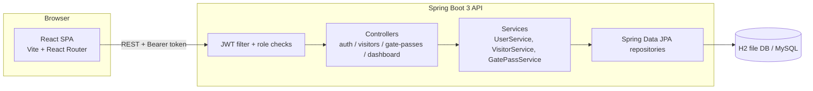
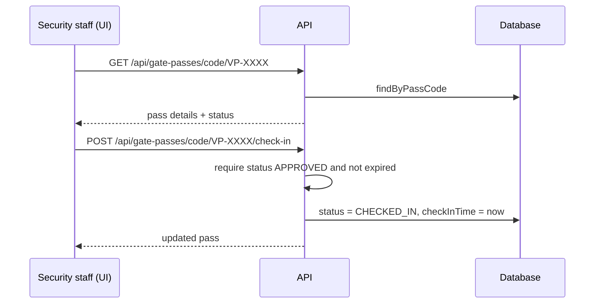

# Architecture

## Layers

| Layer | Responsibility |
| --- | --- |
| `controller` | HTTP endpoints, request validation, DTO mapping |
| `service` | Business rules: pass lifecycle transitions, expiry checks, pass-code generation |
| `repository` | Spring Data JPA persistence |
| `security` | `JwtService` (issue/parse tokens), `JwtAuthenticationFilter`, `AppUserDetailsService` |
| `config` | Security filter chain, CORS, demo data seeding |

## Request flow — check-in at the gate

## Roles

| Role | Can do |
| --- | --- |
| `ADMIN` | Everything: manage users and visitors, approve, check in/out |
| `HOST` | Raise passes, approve/reject/cancel passes, view visitors |
| `SECURITY` | Raise passes, verify passes, check visitors in and out |
