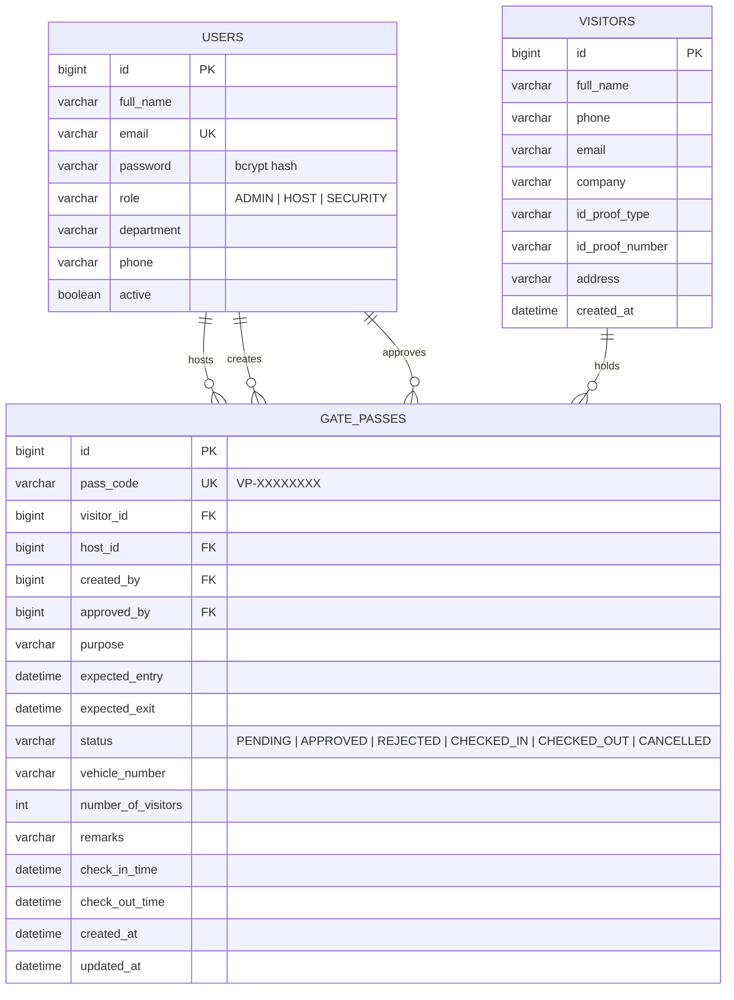

# Entity relationship diagram

## Notes

- `pass_code` is a unique, human-readable code (`VP-` plus 8 characters from an alphabet that
  excludes look-alike characters such as `O`, `0`, `I` and `1`) used by security staff at the gate.
- A visitor is deduplicated by `phone` when a pass is raised with inline visitor details.
- `check_in_time` / `check_out_time` are set only by the gate check-in and check-out operations,
  which makes them the source of truth for the "inside campus now" and "check-ins today" statistics.
